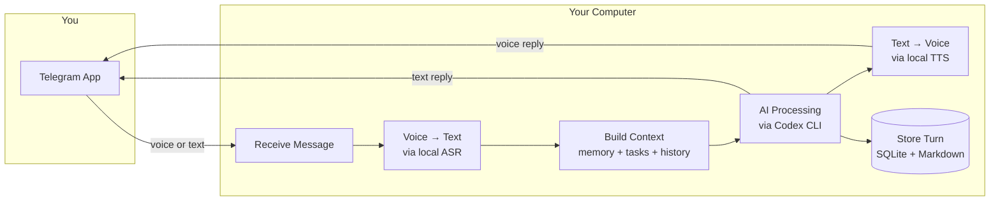
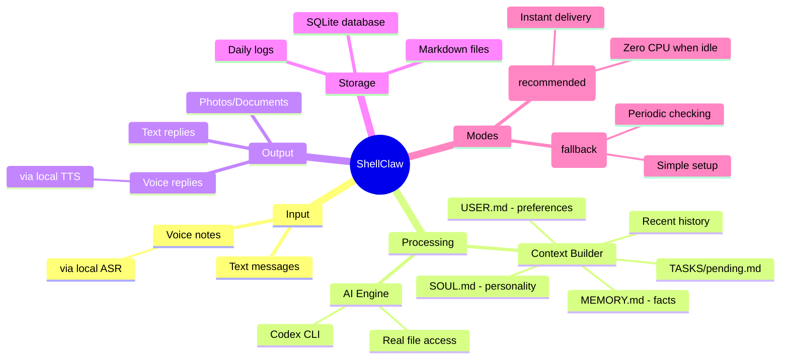
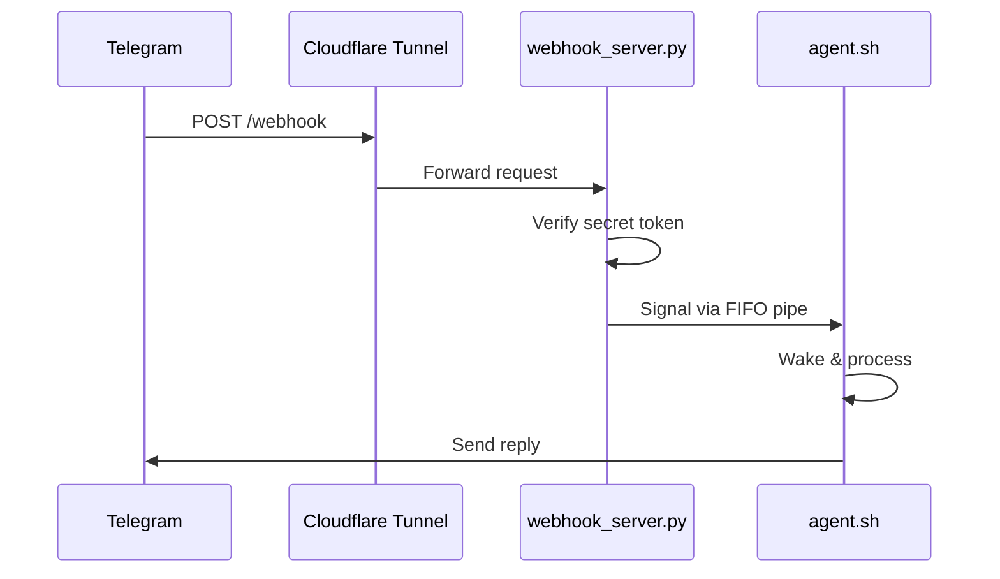

# ShellClaw

*A personal AI assistant that lives in Telegram and runs entirely on your machine.*

Send a voice note → local ASR on your laptop → agent provider (`codex` or `pi`) with real file access + persistent Markdown memory → local TTS voice reply.

**Everything is stored in simple, human-readable `.md` files** you can literally `cat` or open in any editor.

No servers. No heavy frameworks. No Docker-compose. Maximum privacy and hackability.


---

## What Makes ShellClaw Different

| Feature | ShellClaw | Cloud Assistants |
|---------|-----------|------------------|
| Voice processing | Runs locally on your machine | Sent to cloud servers |
| Memory | Stored in plain markdown files you can edit | Locked in vendor databases |
| File access | Can read/write your actual local files | Sandbox with no real access |
| Privacy | Everything stays on your laptop | Data sent to remote servers |
| Offline capability | Works without internet (after setup) | Requires constant connection |

---

## Quick Start

```bash
# Clone and enter the project
git clone https://github.com/lsj5031/ShellClaw.git
cd ShellClaw

# Copy and configure environment
cp .env.example .env
# Edit .env and add your Telegram bot token and chat ID

# Run the setup script
./scripts/setup.sh

# Start ShellClaw
make start
```

Now send a message to your Telegram bot. That's it!

> **Recommended backends** for voice support:
> - ASR: [GlmAsrDocker](https://github.com/lsj5031/GlmAsrDocker) — speech-to-text
> - TTS: [kitten-tts-rs](https://github.com/lsj5031/kitten-tts-rs) — text-to-speech

---

## How It Works



### Step-by-Step Flow

1. **Receive** — ShellClaw gets your message from Telegram
2. **Transcribe** — If it's voice, local ASR converts it to text
3. **Build Context** — Combines your preferences, memory, tasks, and recent history
4. **Process** — Codex CLI (the AI brain) generates a response with real file access
5. **Reply** — Sends text and/or voice back to Telegram
6. **Remember** — Stores the conversation for future context

---

## Key Features

### Persistent Memory That You Control

ShellClaw remembers things across conversations. All memories are stored in `MEMORY.md` — a plain markdown file you can view and edit with any text editor.

```markdown
# Example MEMORY.md
2026-02-23 | User prefers concise responses
2026-02-24 | User is working on a Rust project called CoconutClaw
2026-02-25 | User's timezone is Pacific/Auckland
```

### Task Management

Keep track of todos with `TASKS/pending.md`. ShellClaw can add tasks automatically based on conversations.

### Real File Access

Unlike sandboxed cloud assistants, ShellClaw can actually read and write your local files. Ask it to edit code, organize files, or run commands — it can do it.

### Live Progress Updates

See what ShellClaw is doing in real-time. Your Telegram message updates live as tasks progress.

### Cancel Anytime

Running a long task? Send `/cancel` to stop it immediately.

---

## Architecture Overview



---

## Project Structure

```
ShellClaw/
├── agent.sh              # Main agent loop
├── SOUL.md               # Assistant personality
├── USER.md               # Your preferences
├── MEMORY.md             # Long-term memory (auto-generated)
├── TASKS/pending.md      # Task list
├── scripts/
│   ├── asr.sh            # Voice transcription
│   ├── tts.sh            # Voice synthesis
│   ├── telegram_api.sh   # Telegram API wrapper
│   ├── heartbeat.sh      # Proactive daily message
│   └── nightly_reflection.sh  # Daily journal
├── services/
│   ├── webhook_server.py # Receives Telegram webhooks
│   └── dashboard.py      # Local web UI
├── lib/
│   └── common.sh         # Shared utilities
└── systemd/              # Service definitions
```

---

## Configuration

### Environment Variables

Copy `.env.example` to `.env` and configure:

| Variable | Required | Description |
|----------|----------|-------------|
| `TELEGRAM_BOT_TOKEN` | Yes | Your Telegram bot token from @BotFather |
| `TELEGRAM_CHAT_ID` | Yes | Your Telegram chat/user ID |
| `WEBHOOK_MODE` | No | `on` for webhook, `off` for polling (default: off) |
| `EXEC_POLICY` | No | Safety mode: `strict`, `allowlist`, or `yolo` (default: yolo) |
| `POLL_INTERVAL_SECONDS` | No | Seconds between polls (default: 2) |

### Voice Configuration

Choose one ASR method:
```bash
# HTTP-based ASR
ASR_URL=http://localhost:8080/transcribe

# Or CLI-based ASR
ASR_CMD_TEMPLATE="whisper --file AUDIO_INPUT --output-format txt"
```

Configure TTS:
```bash
TTS_CMD_TEMPLATE="tts --text TEXT --output WAV_OUTPUT"
```

---

## Operating Modes

### Webhook Mode (Recommended)

Telegram pushes updates instantly to ShellClaw via a secure tunnel.



Benefits:
- Instant message delivery
- Zero CPU usage when idle
- Secure with secret token verification

### Polling Mode (Simpler)

ShellClaw periodically checks for new messages.

```bash
WEBHOOK_MODE=off
POLL_INTERVAL_SECONDS=2
```

---

## Service Management

ShellClaw runs as systemd user services for reliability:

```bash
make install   # Install and enable services
make start     # Start all services
make stop      # Stop all services
make status    # Check service status
make logs      # View live logs
```

### Available Services

| Service | Description |
|---------|-------------|
| `shellclaw.service` | Main agent loop |
| `shellclaw-webhook.service` | Webhook HTTP server |
| `shellclaw-tunnel.service` | Cloudflare Tunnel |
| `shellclaw-heartbeat.timer` | Daily proactive message |
| `shellclaw-nightly-reflection.timer` | Daily reflection journal |

---

## Running Multiple Bots

Want separate bots for work and personal use? Use instances:

```bash
# Create a new instance
./scripts/init-instance.sh ~/bots/work-bot

# Configure it
vim ~/bots/work-bot/.env
vim ~/bots/work-bot/SOUL.md

# Run it
./agent.sh --instance-dir ~/bots/work-bot
```

Each instance has its own:
- Configuration (`.env`)
- Personality (`SOUL.md`)
- Memory (`MEMORY.md`)
- Tasks (`TASKS/pending.md`)
- Database (`state.db`)

---

## Output Markers

ShellClaw's AI can respond with various output types:

| Marker | Description |
|--------|-------------|
| `TELEGRAM_REPLY:` | Text response (required) |
| `VOICE_REPLY:` | Text to convert to voice |
| `SEND_PHOTO:` | Photo file path |
| `SEND_DOCUMENT:` | Document file path |
| `SEND_VIDEO:` | Video file path |
| `MEMORY_APPEND:` | Fact to remember |
| `TASK_APPEND:` | Task to add |

---

## Safety Modes

| Mode | Flag | Behavior |
|------|------|----------|
| `yolo` | `--dangerously-bypass-sandbox` | Unrestricted execution (default) |
| `allowlist` | `--full-auto` | Auto-approve allowed commands only |
| `strict` | (none) | Require approval for all actions |

⚠️ **Default mode is `yolo`** — use on trusted machines only.

---

## Dashboard

View your conversation history in a local web UI:

```bash
./services/dashboard.py
# Open http://localhost:8080
```

---

## Requirements

- **Bash** 5+
- **curl**, **jq**, **ffmpeg**, **sqlite3**
- **Codex CLI** in PATH
- ASR backend (for voice input)
- TTS backend (for voice output)
- **cloudflared** (for webhook mode)

---

## License

MIT

---

## Contributing

Contributions welcome! Please open an issue or pull request on GitHub.
