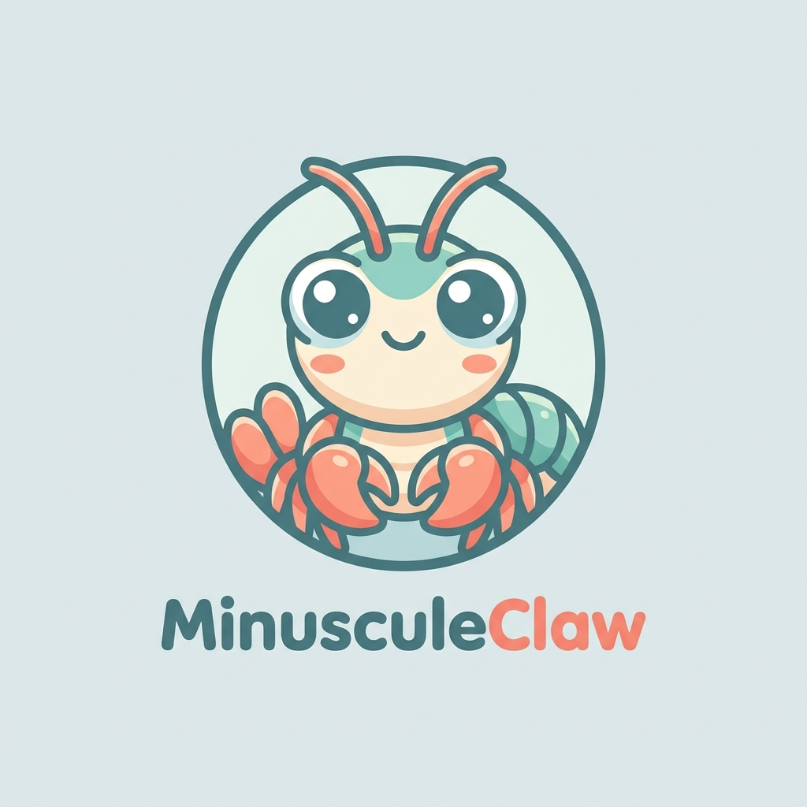
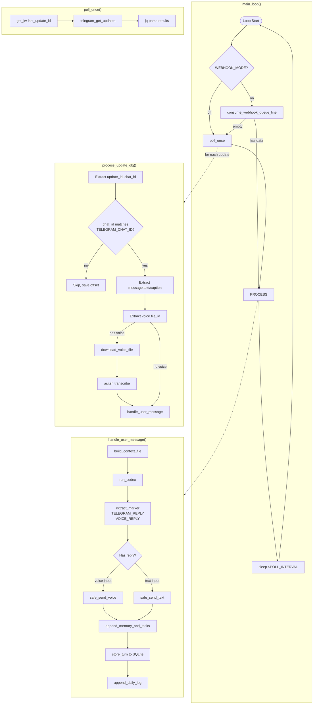
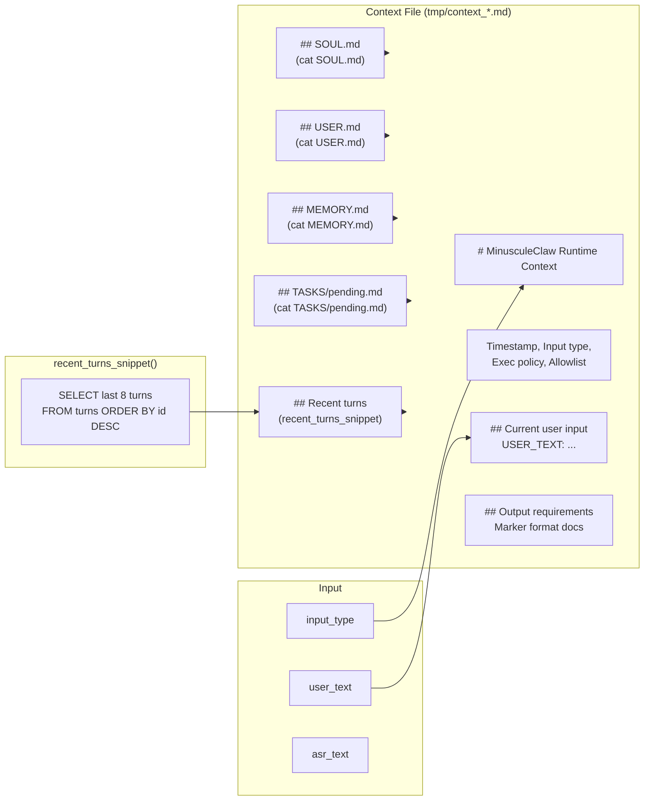
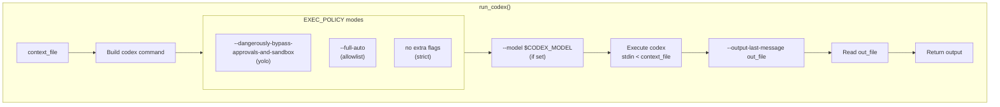
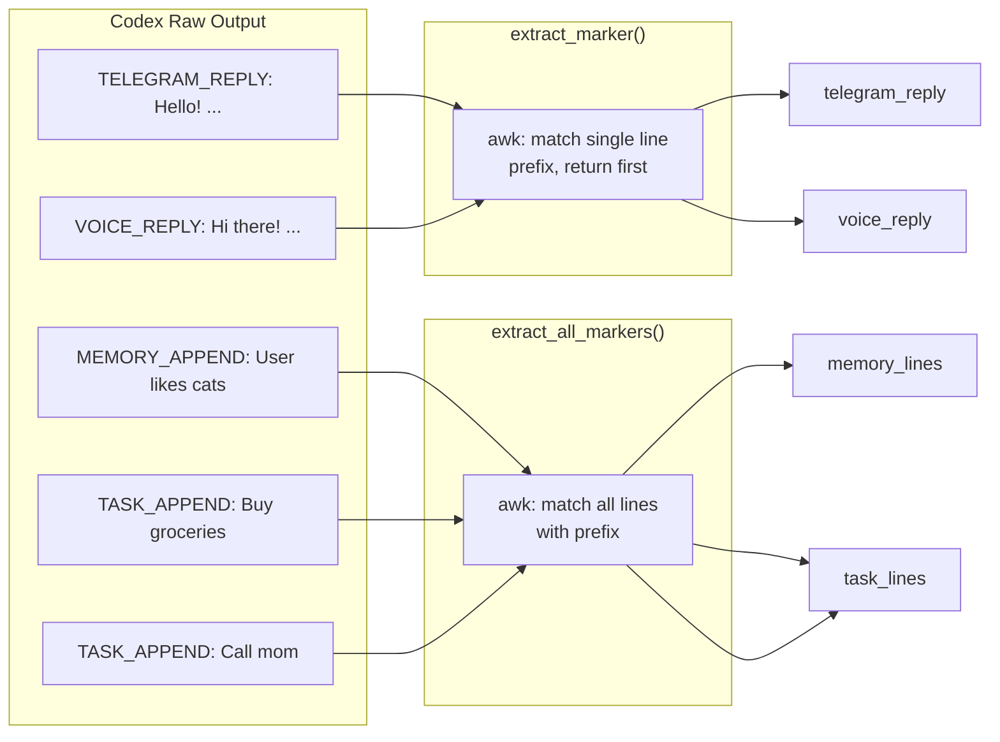
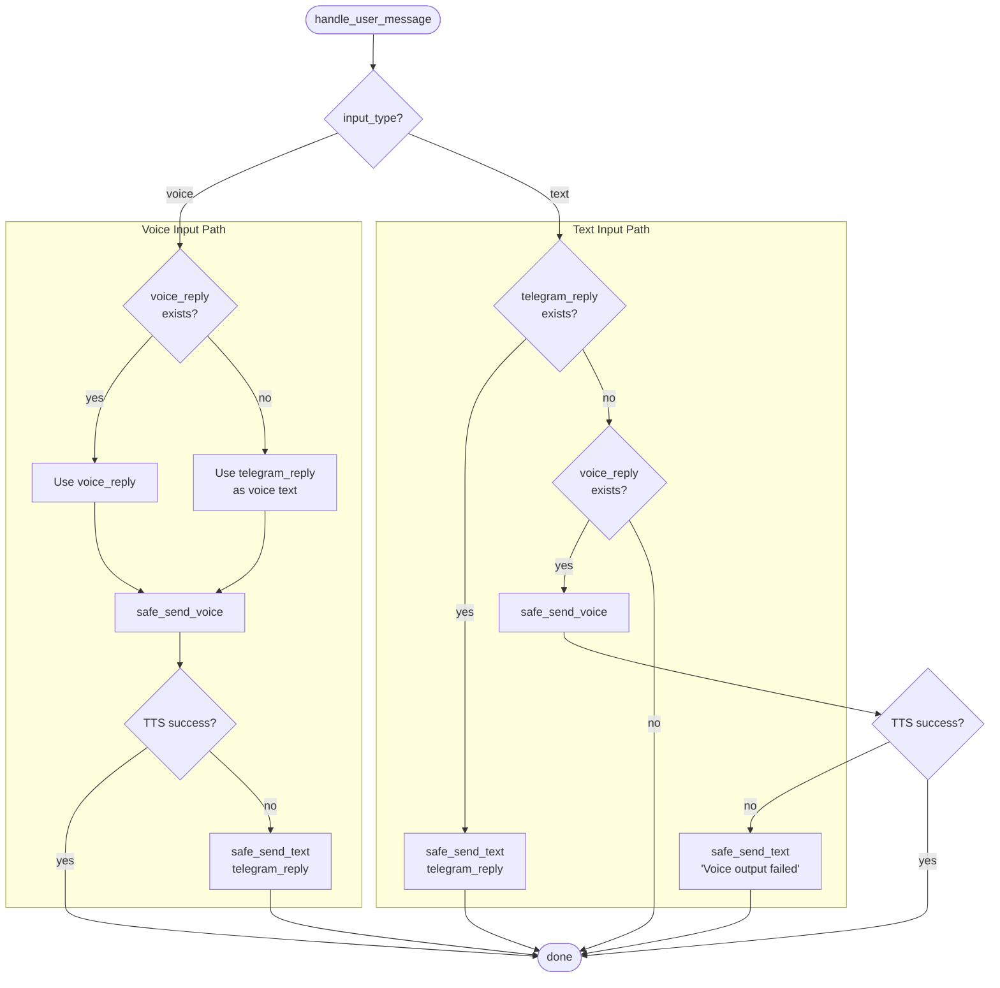
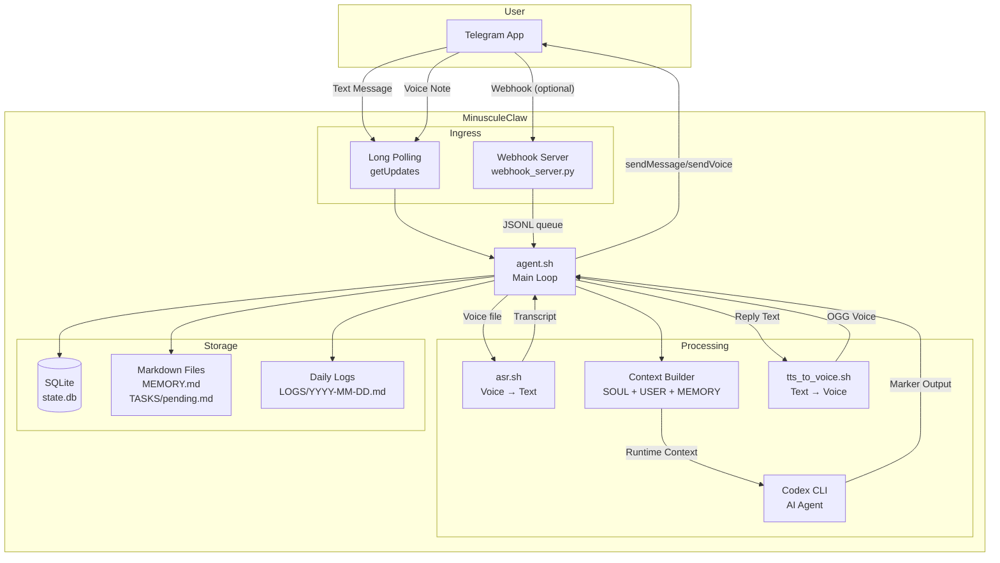
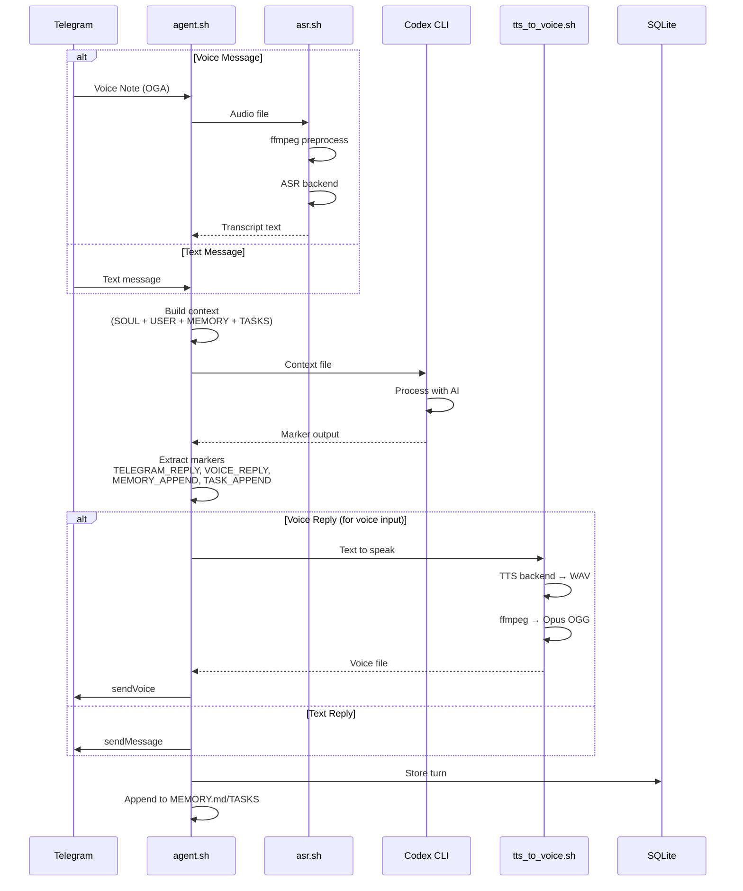
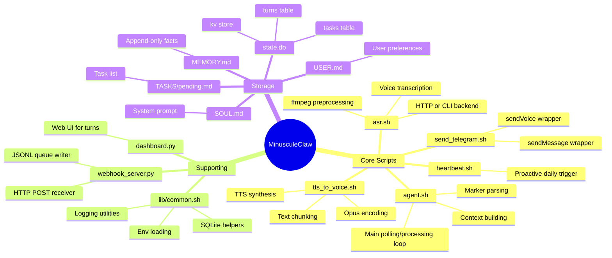
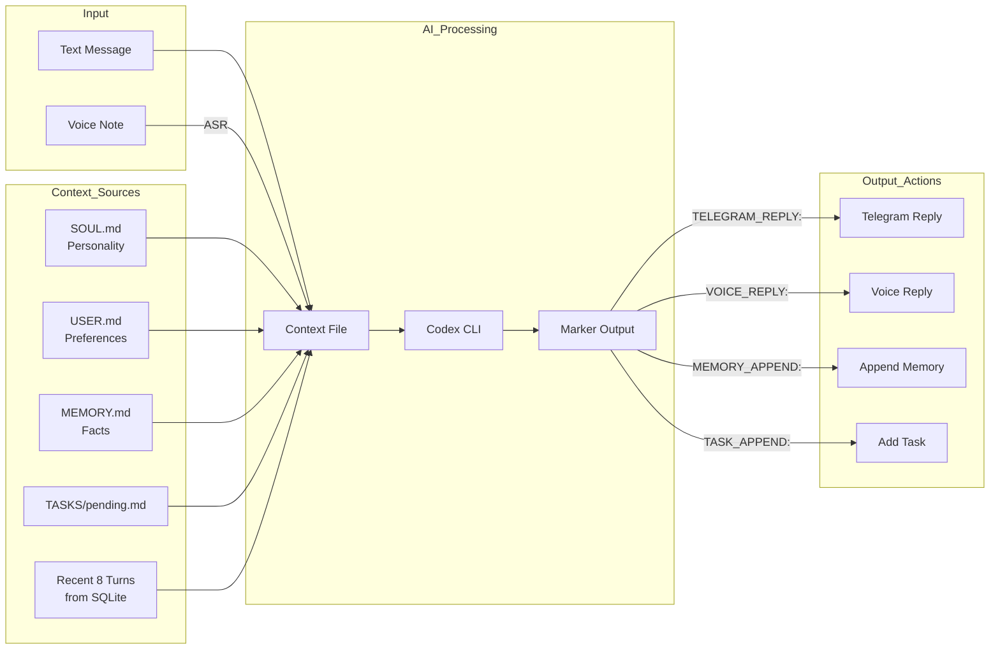

# MinusculeClaw

Bash-powered personal voice agent that runs locally and talks over Telegram.



## agent.sh Internals



## Context Building



## Codex Execution Modes



## Marker Parsing



## Reply Dispatch Logic



## Architecture Overview



## Request Flow



## Components



## Data Flow



## What it does
- Telegram text and voice input.
- Local ASR via your own backend (HTTP endpoint or CLI).
- Agent loop via Codex CLI (`codex exec --yolo`).
- Local TTS backend -> Opus OGG -> Telegram `sendVoice`.
- Persistent state in SQLite + human-readable markdown files.
- Daily logs and optional proactive heartbeat.
- Optional local dashboard on `http://localhost:8080`.

## Repo layout
```
agent.sh          # Main loop - polling, context building, Codex orchestration
asr.sh            # Voice note transcription (HTTP or CLI backend)
tts_to_voice.sh   # Text-to-voice conversion with Opus encoding
send_telegram.sh  # Telegram API wrapper (sendMessage/sendVoice)
heartbeat.sh      # Proactive daily turn trigger
dashboard.py      # Web UI showing last 50 turns
webhook_server.py # Optional webhook receiver (writes to JSONL queue)
lib/common.sh     # Shared helpers (env, SQLite, logging)
SOUL.md           # System prompt / personality
USER.md           # User preferences
MEMORY.md         # Append-only memory facts
TASKS/pending.md  # Task list
```

## Requirements
- Bash 5+
- `curl`, `jq`, `ffmpeg`, `sqlite3`
- `codex` CLI in `PATH`
- A working ASR backend
- A working TTS backend

Recommended backends:
- ASR: https://github.com/lsj5031/GlmAsrDocker
- TTS: https://github.com/lsj5031/kitten-tts-rs

## Quick start
```bash
git clone https://github.com/lsj5031/MinusculeClaw.git
cd MinusculeClaw
./setup.sh
./agent.sh
```

## Environment contract
Copy `.env.example` to `.env`, then set at minimum:
- `TELEGRAM_BOT_TOKEN`
- `TELEGRAM_CHAT_ID`
- `CODEX_BIN` (if `codex` is not in systemd/user PATH)

Then choose one ASR mode:
- `ASR_URL` for HTTP ASR service
- or `ASR_CMD_TEMPLATE` for CLI-based ASR

And set `TTS_CMD_TEMPLATE` for your TTS command.

MinusculeClaw passes:
- `AUDIO_INPUT` and `AUDIO_INPUT_PREP` to ASR command templates
- `TEXT` and `WAV_OUTPUT` to TTS command templates

For backend-specific install/runtime flags, use the backend repos above.

## Codex output contract
MinusculeClaw expects strict markers in Codex output:
- `TELEGRAM_REPLY: ...` (required)
- `VOICE_REPLY: ...` (optional)
- `MEMORY_APPEND: ...` (optional)
- `TASK_APPEND: ...` (optional)

If markers are missing, MinusculeClaw sends a safe fallback text reply and logs `parse_fallback`.

## Ingress modes
- `WEBHOOK_MODE=off` (default): long polling (`getUpdates`).
- `WEBHOOK_MODE=on`: consume updates from `runtime/webhook_updates.jsonl`; run webhook receiver with `./webhook_server.py`.
- `WEBHOOK_PUBLIC_URL`: optional; if set, `setup.sh` can register Telegram webhook.

## systemd (user)
```bash
mkdir -p ~/.config/systemd/user
cp systemd/minusculeclaw* ~/.config/systemd/user/
systemctl --user daemon-reload
systemctl --user enable --now minusculeclaw.service
systemctl --user enable --now minusculeclaw-heartbeat.timer
```

## cron alternative
```bash
crontab cron/minusculeclaw.crontab.example
```

## Dashboard
```bash
./dashboard.py
# open http://localhost:8080
```

## Runtime visibility
- `agent.sh` now prints startup and periodic idle status logs by default.
- Set `AGENT_LOG_LEVEL=debug` in `.env` for detailed polling/update traces.
- If `.env` still has placeholder `replace_me` values for Telegram, startup exits with a clear error.

## Safety note
Default mode uses `EXEC_POLICY=yolo` (`codex exec --yolo`), which allows unrestricted command execution by Codex. Use with caution on trusted machines.

## License
MIT
