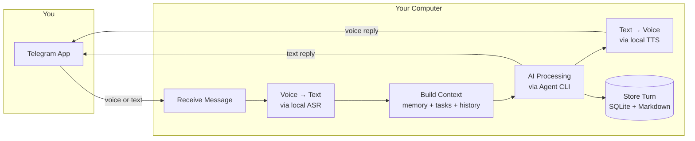
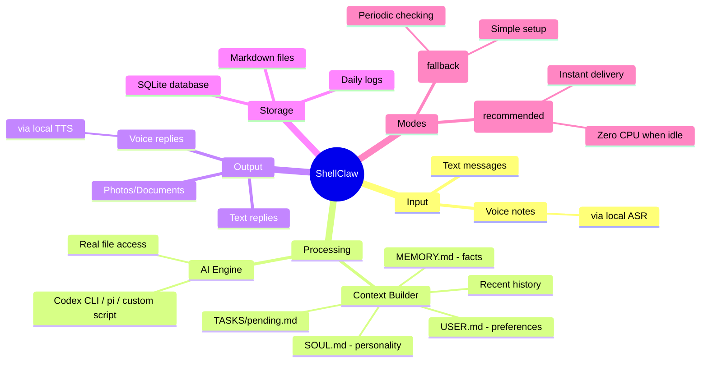
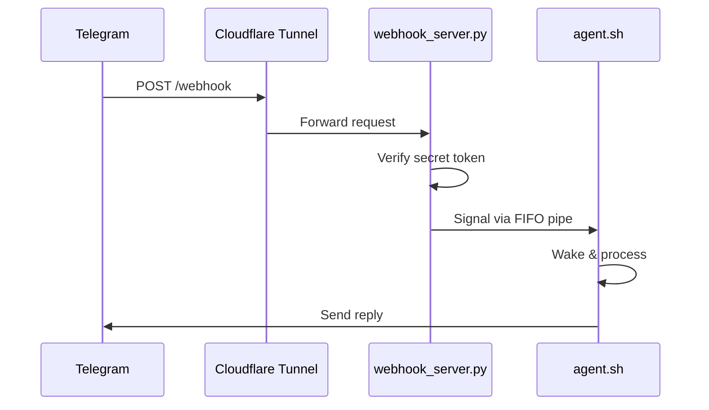

# ShellClaw

*A personal AI assistant that lives in your Telegram and runs entirely on your machine.*

Send a voice note or text message → ShellClaw processes it locally → Get a voice or text reply. Your data never leaves your laptop.

**Privacy-first**: Unlike cloud assistants, ShellClaw keeps everything on your device. No data sent to external servers.


---

## What Makes ShellClaw Different

| Feature | ShellClaw | Cloud Assistants |
|---------|-----------|------------------|
| Voice processing | Runs locally on your machine | Sent to cloud servers |
| Memory | Stored in plain markdown files you can edit | Locked in vendor databases |
| File access | Can read/write your actual local files | Sandbox with no real access |
| Privacy | Everything stays on your laptop | Data sent to remote servers |
| Offline capability | Works without internet (after setup) | Requires constant connection |

---

## Quick Start

```bash
# Clone and enter the project
git clone https://github.com/lsj5031/ShellClaw.git
cd ShellClaw

# Copy and configure environment
cp .env.example .env
# Edit .env and add your Telegram bot token and chat ID

# Run the setup script
./scripts/setup.sh

# Start ShellClaw
make start
```

Now send a message to your Telegram bot. That's it!

> **Recommended backends** for voice support:
> - ASR: [GlmAsrDocker](https://github.com/lsj5031/GlmAsrDocker) — speech-to-text
> - TTS: [kitten-tts-rs](https://github.com/lsj5031/kitten-tts-rs) — text-to-speech

---

## How It Works


```mermaid
flowchart LR
    subgraph You
        TG[Telegram App]
    end

    subgraph Your_Computer["Your Computer"]
        direction TB
        A[Receive Message]
        B[Voice → Text<br/>via local ASR]
        C[Build Context<br/>memory + tasks + history]
        D[AI Processing<br/>via Agent CLI]
        E[Text → Voice<br/>via local TTS]
        F[(Store Turn<br/>SQLite + Markdown)]
    end

    TG -->|"voice or text"| A
    A --> B --> C --> D
    D --> E
    E -->|"voice reply"| TG
    D -->|"text reply"| TG
    D --> F
```

### Step-by-Step Flow

1. **Receive** — ShellClaw gets your message from Telegram
2. **Transcribe** — If it's voice, local ASR converts it to text
3. **Build Context** — Combines your preferences, memory, tasks, and recent history
4. **Process** — Codex CLI (the AI brain) generates a response with real file access
5. **Reply** — Sends text and/or voice back to Telegram
6. **Remember** — Stores the conversation for future context

---

## Key Features

### Persistent Memory That You Control

ShellClaw remembers things across conversations. All memories are stored in `MEMORY.md` — a plain markdown file you can view and edit with any text editor.

```markdown
# Example MEMORY.md
2026-02-23 | User prefers concise responses
2026-02-24 | User is working on a Rust project called CoconutClaw
2026-02-25 | User's timezone is Pacific/Auckland
```

### Task Management

Keep track of todos with `TASKS/pending.md`. ShellClaw can add tasks automatically based on conversations.

### Real File Access

Unlike sandboxed cloud assistants, ShellClaw can actually read and write your local files. Ask it to edit code, organize files, or run commands — it can do it.

### Live Progress Updates

See what ShellClaw is doing in real-time. Your Telegram message updates live as tasks progress.

### Cancel Anytime

Running a long task? Send `/cancel` to stop it immediately.

---

## Architecture Overview


```mermaid
mindmap
  root((ShellClaw))
    Input
      Text messages
      Voice notes
        via local ASR
    Processing
      Context Builder
        SOUL.md - personality
        USER.md - preferences
        MEMORY.md - facts
        TASKS/pending.md
        Recent history
      AI Engine
        Codex CLI / pi / custom script
        Real file access
    Output
      Text replies
      Voice replies
        via local TTS
      Photos/Documents
    Storage
      SQLite database
      Markdown files
      Daily logs
    Modes
      Webhook (recommended)
        Instant delivery
        Zero CPU when idle
      Polling (fallback)
        Simple setup
        Periodic checking
```

---

## Project Structure

```
ShellClaw/
├── agent.sh              # Main agent loop
├── SOUL.md               # Assistant personality
├── USER.md               # Your preferences
├── MEMORY.md             # Long-term memory (auto-generated)
├── TASKS/pending.md      # Task list
├── scripts/
│   ├── asr.sh            # Voice transcription
│   ├── tts.sh            # Voice synthesis
│   ├── telegram_api.sh   # Telegram API wrapper
│   ├── md_to_telegram_html.sh  # Markdown → Telegram HTML
│   ├── heartbeat.sh      # Proactive daily message
│   ├── nightly_reflection.sh  # Daily journal
│   ├── webhook_manage.sh # Webhook setup/management
│   ├── setup.sh          # First-time setup
│   └── init-instance.sh  # Create multi-bot instances
├── services/
│   ├── webhook_server.py # Receives Telegram webhooks
│   └── dashboard.py      # Local web UI
├── lib/
│   └── common.sh         # Shared utilities
├── sql/
│   └── schema.sql        # SQLite database schema
└── systemd/              # Service definitions
```

---

## Configuration

### Environment Variables

Copy `.env.example` to `.env` and configure:

| Variable | Required | Description |
|----------|----------|-------------|
| `TELEGRAM_BOT_TOKEN` | Yes | Your Telegram bot token from @BotFather |
| `TELEGRAM_CHAT_ID` | Yes | Your Telegram chat/user ID |
| `WEBHOOK_MODE` | No | `on` for webhook, `off` for polling (default: off) |
| `EXEC_POLICY` | No | Safety mode: `strict`, `allowlist`, or `yolo` (default: yolo) |
| `ALLOWLIST_PATH` | No | Path to allowlist file (default: config/allowlist.txt). Format: one command per line, e.g. `ls`, `cat`, `grep` |
| `POLL_INTERVAL_SECONDS` | No | Seconds between polls (default: 2) |
| `TIMEZONE` | No | Your timezone for timestamps (default: UTC) |
| `TELEGRAM_PARSE_MODE` | No | `HTML`, `Markdown`, `MarkdownV2`, or `off` (default: HTML) |
| `AGENT_LOG_LEVEL` | No | `info` or `debug` for troubleshooting (default: info) |

### Agent Provider

ShellClaw supports multiple AI backends:

```bash
# Codex CLI (default)
AGENT_PROVIDER=codex
CODEX_BIN=codex                    # Binary name (default: codex)
CODEX_MODEL=                       # Optional: specific model to use
CODEX_REASONING_EFFORT=            # Optional: low, medium, high

# Or pi CLI
AGENT_PROVIDER=pi
PI_BIN=pi                          # Binary name (default: pi)
PI_PROVIDER=                       # Optional: specific provider
PI_MODEL=                          # Optional: specific model
PI_MODE=text                       # Output mode: text or json
PI_EXTRA_ARGS=                     # Optional: extra CLI arguments

# Or custom script
AGENT_PROVIDER=script
AGENT_CMD_TEMPLATE='my-agent-cli --mode text'
```

When using `script` provider, your script receives context on stdin and must output marker lines (`TELEGRAM_REPLY:`, etc.) on stdout.

### Voice Configuration

Configure ASR (speech-to-text):
```bash
# HTTP-based ASR
ASR_URL=http://localhost:8080/transcribe
ASR_FILE_FIELD=file              # Form field name (default: file)
ASR_TEXT_JQ=.text                # jq expression to extract text

# Or CLI-based ASR
ASR_CMD_TEMPLATE="whisper --file AUDIO_INPUT --output-format txt"
ASR_PREPROCESS=on                # Convert audio to 16kHz mono (default: on)
ASR_SAMPLE_RATE=16000            # Target sample rate (default: 16000)
```

Configure TTS (text-to-speech):
```bash
TTS_CMD_TEMPLATE="tts --text TEXT --output WAV_OUTPUT"
VOICE_BITRATE=32k                  # Voice quality (default: 32k)
LOCAL_SPEAKER_PLAYBACK=off         # Play voice locally (default: off)
TTS_MAX_CHARS=260                  # Max chars per TTS chunk (default: 260)
```

**Note**: ShellClaw automatically converts Markdown to Telegram HTML when `TELEGRAM_PARSE_MODE=HTML`. For very long replies, if [markie](https://github.com/slapd/markie) is installed, it renders to an SVG image instead.

---

## Operating Modes

### Webhook Mode (Recommended)

Telegram pushes updates instantly to ShellClaw via a secure tunnel.


```mermaid
sequenceDiagram
    participant T as Telegram
    participant CF as Cloudflare Tunnel
    participant W as webhook_server.py
    participant A as agent.sh

    T->>CF: POST /webhook
    CF->>W: Forward request
    W->>W: Verify secret token
    W->>A: Signal via FIFO pipe
    A->>A: Wake & process
    A->>T: Send reply
```

Benefits:
- Instant message delivery
- Zero CPU usage when idle
- Secure with secret token verification

### Polling Mode (Simpler)

ShellClaw periodically checks for new messages.

```bash
WEBHOOK_MODE=off
POLL_INTERVAL_SECONDS=2
```

---

## Service Management

ShellClaw runs as systemd user services for reliability:

```bash
make install   # Install and enable services
make start     # Start all services
make stop      # Stop all services
make status    # Check service status
make logs      # View live logs
```

### Available Services

| Service | Description |
|---------|-------------|
| `shellclaw.service` | Main agent loop |
| `shellclaw-webhook.service` | Webhook HTTP server |
| `shellclaw-tunnel.service` | Cloudflare Tunnel |
| `shellclaw-heartbeat.timer` | Daily proactive message |
| `shellclaw-nightly-reflection.timer` | Daily reflection journal |

---

## Running Multiple Bots

Want separate bots for work and personal use? Use instances:

```bash
# Create a new instance
./scripts/init-instance.sh ~/bots/work-bot

# Configure it
vim ~/bots/work-bot/.env
vim ~/bots/work-bot/SOUL.md

# Run it
./agent.sh --instance-dir ~/bots/work-bot
```

Each instance has its own:
- Configuration (`.env`)
- Personality (`SOUL.md`)
- Memory (`MEMORY.md`)
- Tasks (`TASKS/pending.md`)
- Database (`state.db`)

---

## Output Markers

ShellClaw's AI can respond with various output types:

| Marker | Description |
|--------|-------------|
| `TELEGRAM_REPLY:` | Text response (required) |
| `VOICE_REPLY:` | Text to convert to voice |
| `SEND_PHOTO:` | Photo file path |
| `SEND_DOCUMENT:` | Document file path |
| `SEND_VIDEO:` | Video file path |
| `MEMORY_APPEND:` | Fact to remember |
| `TASK_APPEND:` | Task to add |

---

## Built-in Commands

| Command | Action |
|---------|--------|
| `/fresh` | Clear conversation context and start fresh |
| `/cancel` | Stop the currently running request |

## Safety Modes

| Mode | Flag | Behavior |
|------|------|----------|
| `yolo` | `--dangerously-bypass-sandbox` | Unrestricted execution (default) |
| `allowlist` | `--full-auto` | Auto-approve commands in allowlist only |
| `strict` | (none) | Require approval for every action |

⚠️ **Default mode is `yolo`** — only use on machines you trust completely.

---

## Dashboard

View your conversation history in a local web UI:

```bash
./services/dashboard.py
# Open http://localhost:8080
```

---

## Requirements

- **Bash** 5+
- **curl**, **jq**, **ffmpeg**, **sqlite3**
- **Agent CLI** in PATH (Codex, pi, or your custom script)
- ASR backend (for voice input) — e.g., GlmAsrDocker, whisper CLI
- TTS backend (for voice output) — e.g., kitten-tts-rs, piper
- **cloudflared** (for webhook mode only)

---

## Troubleshooting

### Bot not responding in Telegram
- Verify your `TELEGRAM_BOT_TOKEN` and `TELEGRAM_CHAT_ID` are correct in `.env`
- Check the bot is running: `make status`
- View logs: `make logs`
- In groups, talk to @BotFather and **Disable Privacy Mode** for your bot

### Webhook registration failed
- Ensure `cloudflared` is running and the tunnel is healthy
- Test manually:
  ```bash
  curl -X POST https://your-tunnel-url.trycloudflare.com/webhook -d '{"message": {"text": "ping"}}'
  ```
- Verify `WEBHOOK_SECRET` matches between `.env` and your tunnel config

### Voice recognition (ASR) is slow or inaccurate
- Check if your ASR backend is using GPU acceleration
- Ensure the input audio format (OGG/OPUS from Telegram) is supported
- Try adjusting `ASR_SAMPLE_RATE` (default: 16000)
- Set `ASR_PREPROCESS=off` if your ASR handles format conversion

### Agent not executing commands
- Verify the agent CLI (Codex/pi) is in PATH: `which codex`
- Check `EXEC_POLICY` in `.env` — default is `yolo` (unrestricted)
- If using `allowlist` mode, ensure commands are listed in `config/allowlist.txt`

### Long replies not sending
- If [markie](https://github.com/slapd/markie) is installed, long replies render as SVG
- Otherwise, they fallback to markdown file upload
- Check logs for "failed to send" warnings

---

## Configuration Examples

### Minimal text-only setup
```bash
TELEGRAM_BOT_TOKEN=123456:ABC-DEF1234ghIkl-zyx57W2v1u123ew11
TELEGRAM_CHAT_ID=123456789
AGENT_PROVIDER=codex
```

### Voice-enabled setup (with kitten-tts and glm-asr)
```bash
TELEGRAM_BOT_TOKEN=123456:ABC-DEF1234ghIkl-zyx57W2v1u123ew11
TELEGRAM_CHAT_ID=123456789
ASR_CMD_TEMPLATE='glm-asr transcribe "$AUDIO_INPUT_PREP"'
TTS_CMD_TEMPLATE='kitten-tts synthesize --text "$TEXT" --output "$WAV_OUTPUT"'
```

### Multi-instance setup (work and personal bots)
```bash
# Instance 1: work-bot in ~/bots/work-bot
# Create with: ./scripts/init-instance.sh ~/bots/work-bot
# Run with: ./agent.sh --instance-dir ~/bots/work-bot

# Instance 2: personal-bot in ~/bots/personal-bot  
# Create with: ./scripts/init-instance.sh ~/bots/personal-bot
# Run with: ./agent.sh --instance-dir ~/bots/personal-bot
```

---

## License

MIT

---

## Contributing

Contributions welcome! Please open an issue or pull request on GitHub.
