# ShellClaw 🦀

**Pure-bash local voice agent that lives in Telegram.**

Send a voice note → local ASR on your laptop → Codex CLI (with real file access + persistent Markdown memory) → local TTS voice reply.

**Everything is stored in simple, human-readable `.md` files** you can literally `cat` or open in any editor.

No servers. No heavy frameworks. No Docker-compose. Maximum privacy and hackability.


## ✨ Why people love it

- Full voice round-trip with **local** ASR + TTS
- Persistent memory & tasks you can read/edit by hand (`cat MEMORY.md`)
- Uses OpenAI **Codex CLI** as the brain (it can actually read/write your files)
- Live progress updates in Telegram (edits message with what Codex is doing)
- `/cancel` command to interrupt long-running requests mid-execution
- Local web dashboard (`http://localhost:8080`)
- Optional daily heartbeat (the bot can message you proactively)
- Optional nightly reflection journal (auto-written to markdown)
- Three safety modes: `strict` | `allowlist` | `yolo`
- Works great in English and Chinese (and likely more)

## 🚀 Quick Start

```bash
git clone https://github.com/lsj5031/ShellClaw.git
cd ShellClaw

cp .env.example .env
# Edit .env → add your TELEGRAM_BOT_TOKEN and TELEGRAM_CHAT_ID

./scripts/setup.sh            # interactive: sets .env, inits DB
make install           # installs systemd units, enables linger
make start             # starts agent (poll mode by default)

# Optional: for webhook mode instead of polling, set WEBHOOK_MODE=on in .env, then:
# make webhook-register && make start
```

**Recommended backends** (super easy to run):
- ASR → [GlmAsrDocker](https://github.com/lsj5031/GlmAsrDocker)
- TTS → [kitten-tts-rs](https://github.com/lsj5031/kitten-tts-rs)

Then just send a voice note to your Telegram bot — done!

## What it does

- Telegram text and voice input.
- Local ASR via your own backend (HTTP endpoint or CLI).
- Agent loop via Codex CLI (`codex exec`).
- Local TTS backend → Opus OGG → Telegram `sendVoice`.
- Persistent state in SQLite + human-readable markdown files.
- Daily logs, proactive heartbeat, and nightly reflection journal.
- Optional local dashboard on `http://localhost:8080`.

## How it works (high-level)

1. Telegram voice/text → `agent.sh`
2. Local ASR (`scripts/asr.sh`) → transcript
3. Build rich context (`SOUL.md` + `USER.md` + `MEMORY.md` + `TASKS/pending.md` + recent history)
4. `codex exec --json` with special marker contract + live Telegram progress updates
5. Parse markers → reply via text or local TTS (`scripts/tts.sh`)
6. Auto-append to memory/tasks + log everything

## Repo layout

```text
agent.sh                 # Main loop - webhook or poll, context building, Codex orchestration
scripts/
  asr.sh                 # Voice note transcription (HTTP or CLI backend)
  tts.sh                 # Text-to-voice conversion with Opus encoding
  telegram_api.sh        # Telegram API wrapper (sendMessage/sendVoice/editMessageText)
  heartbeat.sh           # Proactive daily turn trigger
  nightly_reflection.sh  # Sleep-time reflection trigger + markdown journal append
  webhook_manage.sh      # Register/unregister/status for Telegram webhook
  setup.sh               # Interactive bootstrap/migration script
services/
  webhook_server.py      # Webhook receiver (secret token, flock, FIFO signal)
  dashboard.py           # Web UI showing last 50 turns
lib/common.sh            # Shared helpers (env, SQLite, logging)
Makefile                 # Service lifecycle: make install/start/stop/restart/status/logs
SOUL.md                  # System prompt / personality
USER.md                  # User preferences
MEMORY.md                # Append-only memory facts
TASKS/pending.md         # Task list
```

## Requirements

- Bash 5+
- `curl`, `jq`, `ffmpeg`, `sqlite3`
- `codex` CLI in `PATH`
- A working ASR backend
- A working TTS backend
- `cloudflared` (for webhook mode with Cloudflare Tunnel)

---

## Deep Technical Dive

### agent.sh Internals


### Context Building


### Codex Execution Modes


### Marker Parsing


### Reply Dispatch Logic


### Architecture Overview

```mermaid
flowchart TB
    subgraph User
        TG[Telegram App]
    end

    subgraph ShellClaw
        direction TB
        AGENT[agent.sh]

        subgraph Ingress
            direction TB
            subgraph webhook_path["Webhook Mode (default)"]
                CF[cloudflared tunnel]
                WH[services/webhook_server.py<br/>secret token + flock]
                FIFO([FIFO notify pipe])
            end
            POLL[Long Polling<br/>getUpdates<br/>fallback mode]
        end

        subgraph Processing
            ASR[scripts/asr.sh<br/>Voice → Text]
            CTX[Context Builder<br/>SOUL + USER + MEMORY]
            CODEX[Codex CLI<br/>AI Agent]
            TTS[scripts/tts.sh<br/>Text → Voice]
        end

        subgraph Storage
            SQLITE[(SQLite<br/>state.db)]
            MD[Markdown Files<br/>MEMORY.md<br/>TASKS/pending.md]
            LOGS[Daily Logs<br/>LOGS/YYYY-MM-DD.md]
        end
    end

    TG -->|"voice/text"| AGENT
    AGENT --> ASR
    ASR --> CTX
    CTX --> CODEX
    CODEX --> TTS
    TTS -->|"voice reply"| TG
    CODEX -->|"text reply"| TG
    AGENT --> SQLITE
    AGENT --> MD
    AGENT --> LOGS

    CF --> WH --> FIFO --> AGENT
    TG -->|"webhook POST"| CF
    TG -->|"getUpdates"| POLL
    POLL --> AGENT
```



### Request Flow (Sequence)

```mermaid
sequenceDiagram
    participant T as Telegram
    participant A as agent.sh
    participant ASR as scripts/asr.sh
    participant C as Codex CLI
    participant TTS as scripts/tts.sh
    participant DB as SQLite

    T->>A: Voice message / Text
    
    alt Voice Input
        A->>A: download_telegram_file
        A->>ASR: Transcribe audio
        ASR-->>A: Transcript text
    end

    A->>A: build_context_file
    A->>T: sendMessage "⏳ Thinking…" (get message_id)

    A->>C: codex exec --json < context
    
    loop JSONL stream events
        C-->>A: item.started / item.completed
        A->>T: editMessageText (live status)
    end
    
    C-->>A: Final agent message (markers)

    alt Voice Reply
        A->>TTS: Generate voice
        TTS->>TTS: ffmpeg → Opus OGG
        TTS-->>A: Voice file
        A->>T: sendVoice
        A->>T: editMessageText (text version)
    else Text Reply
        A->>T: editMessageText (final reply)
    end

    A->>DB: Store turn
    A->>A: Append to MEMORY.md/TASKS
```



### Components


### Data Flow


## Environment contract

Copy `.env.example` to `.env`, then set at minimum:
- `TELEGRAM_BOT_TOKEN`
- `TELEGRAM_CHAT_ID`
- `CODEX_BIN` (if `codex` is not in systemd/user PATH)

Then choose one ASR mode:
- `ASR_URL` for HTTP ASR service
- or `ASR_CMD_TEMPLATE` for CLI-based ASR

And set `TTS_CMD_TEMPLATE` for your TTS command.

ShellClaw passes:
- `AUDIO_INPUT` and `AUDIO_INPUT_PREP` to ASR command templates
- `TEXT` and `WAV_OUTPUT` to TTS command templates

For backend-specific install/runtime flags, use the backend repos above.

Optional nightly reflection settings:
- `NIGHTLY_REFLECTION_FILE` (default `./LOGS/nightly_reflection.md`)
- `NIGHTLY_REFLECTION_SKIP_AGENT=on` for dry-run/template-only writes

## Codex output contract

ShellClaw expects strict markers in Codex output:
- `TELEGRAM_REPLY: ...` (required)
- `VOICE_REPLY: ...` (optional)
- `SEND_PHOTO: <absolute path>` (optional)
- `SEND_DOCUMENT: <absolute path>` (optional)
- `SEND_VIDEO: <absolute path>` (optional)
- `MEMORY_APPEND: ...` (optional)
- `TASK_APPEND: ...` (optional)

If markers are missing, ShellClaw sends a safe fallback text reply and logs `parse_fallback`.

## Ingress modes

### Webhook mode (recommended, `WEBHOOK_MODE=on`)

Telegram pushes updates via webhook → cloudflared tunnel → `services/webhook_server.py` → JSONL queue.
The agent sleeps on a FIFO pipe and wakes instantly when new data arrives (zero-CPU idle).

- `WEBHOOK_PUBLIC_URL` — your tunnel domain (e.g. `https://claw.liu.nz`)
- `WEBHOOK_SECRET` — secret token verified via `X-Telegram-Bot-Api-Secret-Token` header
- Queue writes are `flock`-protected against reader/writer races
- Register/unregister with `./scripts/webhook_manage.sh register|unregister|status`

### Poll mode (fallback, `WEBHOOK_MODE=off`)

Agent calls `getUpdates` every `POLL_INTERVAL_SECONDS` (default 2s). No extra services needed.

## Makefile

```bash
make help              # show all targets
make install           # install systemd units + enable linger
make start / stop      # start/stop all services
make restart           # restart all services
make status            # show service status
make logs              # follow agent logs (also: logs-webhook, logs-tunnel, logs-reflection)
make webhook-register  # register Telegram webhook
make webhook-status    # check webhook info
make lint              # shellcheck all scripts
make test              # smoke test via --inject-text
```

## systemd services

| Unit | Description |
|------|-------------|
| `shellclaw.service` | Main agent loop (webhook or poll) |
| `shellclaw-webhook.service` | Webhook HTTP server on `:8787` |
| `shellclaw-tunnel.service` | Cloudflare Tunnel (`cloudflared`) |
| `shellclaw-heartbeat.timer` | Daily heartbeat at 09:00 |
| `shellclaw-nightly-reflection.timer` | Daily reflection at 22:30 (local time) |

Install all with `make install`, or manually:
```bash
cp systemd/shellclaw* ~/.config/systemd/user/
systemctl --user daemon-reload
systemctl --user enable shellclaw.service shellclaw-webhook.service shellclaw-tunnel.service shellclaw-heartbeat.timer shellclaw-nightly-reflection.timer
sudo loginctl enable-linger $USER   # services survive logout & start on boot
```

## Dashboard

```bash
./services/dashboard.py
# open http://localhost:8080
```

## Runtime visibility

- `agent.sh` prints startup and periodic idle status logs by default.
- Set `AGENT_LOG_LEVEL=debug` in `.env` for detailed polling/update traces.
- If `.env` still has placeholder `replace_me` values for Telegram, startup exits with a clear error.

## Safety note

Default mode uses `EXEC_POLICY=yolo` (`codex exec --yolo`), which allows unrestricted command execution by Codex. Use with caution on trusted machines.

## License

MIT
